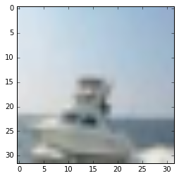
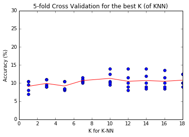

## 필요 라이브러리 호출

```python
import numpy as np
import operator
import os
import pickle
import matplotlib.pyplot as plt
%matplotlib inline
```

```python
CIFAR_DATASETS_PATH = "./cifar-10-batches-py/"
```

```python
# CIFAR-10 Data 위치 찾음
fileList = []
for file in os.listdir(CIFAR_DATASETS_PATH):
    fileList.append(CIFAR_DATASETS_PATH + file)


# 0 -> label
# 1:5 -> Train Set
# 7 -> Test Set
LabelData = fileList[0]
TrainDatasets = fileList[1:5]
TestDatasets = fileList[7]
print(LabelData)
print(TrainDatasets)
print(TestDatasets)
```

    ./cifar-10-batches-py/batches.meta
    ['./cifar-10-batches-py/data_batch_1', './cifar-10-batches-py/data_batch_2', './cifar-10-batches-py/data_batch_3', './cifar-10-batches-py/data_batch_4']
    ./cifar-10-batches-py/test_batch

# Helper Functions

필요한 함수들

```python
def load_data(file):
    with open(file, 'rb') as f:
        data = pickle.load(f, encoding='bytes')
    return data


def load_multiple_data(fileList):
    X, Y = [], []
    for file in fileList:
        data = load_data(file)
        X.append(data[b'data'])
        Y.append(data[b'labels'])
    return np.concatenate(X), np.concatenate(Y)

labels = load_data(LabelData)[b'label_names']
def get_object(number):
    global labels
    return labels[int(number)]

def view_img(X):
    '''
    input
        X  : 3072 x 1 Array
    '''
    plt.imshow(X.reshape(3,32,32).transpose(1,2,0))
```

```python
Xtr, Ytr = load_multiple_data(TrainDatasets)
Xte, Yte = load_multiple_data([TestDatasets])
## 형태 확인
# X_train : 40,000 * 3,072
# Y_train : 40,000 * 1
# X_test  : 10,000 * 3,072
# Y_test  : 10,000 * 1
print(Xtr.shape, Ytr.shape, Xte.shape, Yte.shape)
```

    (40000, 3072) (40000,) (10000, 3072) (10000,)

```python
## sample 이미지 확인
i = 100 # 이미지 확인해볼 index
view_img(Xtr[i])
get_object(Ytr[i])
```

    b'ship'



## (k)Nearest Neighbor 클래스 define

```python
class NearestNeighbor(object):
    def train(self, X, Y):
        self.Xtr = X
        self.Ytr = Y


    def predict(self, X, k=1):
        """
        input:
            X  : N x 3072 shaped numpy array where N indicates the number of images to predict
            k   : when k > 1, knn

        return:
            Ypred  : N x 1 numpy array and its element is an integer varying from 0 to 9
        """
        how_many_to_predict = X.shape[0]

        Y_pred = np.ones(X.shape[0]) * -1 # create an array length of N (-1 for nothing)

        for i in range(how_many_to_predict):
            distances = np.sum(np.abs(X[i, :] - self.Xtr), axis = 1)
            list_with_labels = []
            for label, dist in zip(self.Ytr, distances):
                list_with_labels.append((label, dist))
            list_with_labels = sorted(list_with_labels, key=operator.itemgetter(1))

            if k == 1: # 1- Nearest Neighbor
                Y_pred[i] = list_with_labels[0][0]

            else: # K > 1
                possible_results = list_with_labels[:k]
                result_sets  = {}
                for label, dist in possible_results:
                    if label in result_sets.keys():
                        result_sets[label] += 1
                    else:
                        result_sets[label] = 1

                result_sets = sorted(result_sets.items(), key=operator.itemgetter(1))
                Y_pred[i] = result_sets[-1][0]

        return Y_pred
```

#### Accuracy Test Function

```python
def Accuracy(Y_pred, Y_real, verbose=True):
    acc = np.mean(Y_pred == Y_real)
    if verbose:
        print("=================")
        print("Accuracy: {:.1f}%".format(acc * 100.0))
        print("=================")
    return acc
```

```python
nn = NearestNeighbor()
nn.train(Xtr, Ytr)
```

## Test Data 10000개는 너무 오래걸려서 샘플로 테스트

```python
randomChoices = np.random.choice(range(Xte.shape[0]), size = 5, replace=False)
```

```python
y_pred = nn.predict(Xte[randomChoices])
y_real = Yte[randomChoices]
for y1, y2 in zip(y_pred, y_real):
    print("Predicted: {} \t\t\t Real: {}".format(get_object(y1), get_object(y2)))
Accuracy(y_pred, y_real)
```

    Predicted: b'cat' 			 Real: b'dog'
    Predicted: b'automobile' 			 Real: b'truck'
    Predicted: b'dog' 			 Real: b'bird'
    Predicted: b'deer' 			 Real: b'cat'
    Predicted: b'deer' 			 Real: b'bird'
    =================
    Accuracy: 0.0%
    =================


    0.0

## KNN when K > 1

```python
y_pred = nn.predict(Xte[randomChoices], k=5)
y_real = Yte[randomChoices]
for y1, y2 in zip(y_pred, y_real):
    print("Predicted: {} \t\t\t Real: {}".format(get_object(y1), get_object(y2)))
Accuracy(y_pred, y_real)
```

    Predicted: b'dog' 			 Real: b'dog'
    Predicted: b'automobile' 			 Real: b'truck'
    Predicted: b'deer' 			 Real: b'bird'
    Predicted: b'frog' 			 Real: b'cat'
    Predicted: b'deer' 			 Real: b'bird'
    =================
    Accuracy: 20.0%
    =================


    0.20000000000000001

## Train Set에 대한 검증

#### K = 1 일때 NN의 정확도는 항상 1이 나와야 한다

```python
randomChoices = np.random.choice(range(Xtr.shape[0]), size = 5, replace=False)
```

```python
y_pred = nn.predict(Xtr[randomChoices], k=1)
y_real = Ytr[randomChoices]
for y1, y2 in zip(y_pred, y_real):
    print("Predicted: {} \t\t\t Real: {}".format(get_object(y1), get_object(y2)))
Accuracy(y_pred, y_real) # 항상 100%가 나와야 함
```

    Predicted: b'bird' 			 Real: b'bird'
    Predicted: b'truck' 			 Real: b'truck'
    Predicted: b'frog' 			 Real: b'frog'
    Predicted: b'deer' 			 Real: b'deer'
    Predicted: b'frog' 			 Real: b'frog'
    =================
    Accuracy: 100.0%
    =================


    1.0

#### K = 5 일 때

```python
y_pred = nn.predict(Xtr[randomChoices], k=100)
y_real = Ytr[randomChoices]
for y1, y2 in zip(y_pred, y_real):
    print("Predicted: {} \t\t\t Real: {}".format(get_object(y1), get_object(y2)))
Accuracy(y_pred, y_real)
```

    Predicted: b'bird' 			 Real: b'bird'
    Predicted: b'truck' 			 Real: b'truck'
    Predicted: b'deer' 			 Real: b'frog'
    Predicted: b'cat' 			 Real: b'deer'
    Predicted: b'ship' 			 Real: b'frog'
    =================
    Accuracy: 40.0%
    =================


    0.40000000000000002

## Cross Validation

```python
def Cross_Validations(X, Y, k_for_KNN, k_folds = 5):
    chunks = X.shape[0] // k_folds

    sample = np.arange(X.shape[0])
    np.random.shuffle(sample)

    results = [] # [ (k, mean of acc)]
    raw = []
    for k in k_for_KNN:

        temp_acc = np.zeros(k_folds)
        for i in range(k_folds):
            # 0,1,2,3,4 (len = 10, chunks = 2)
            test_index = sample[i*chunks: (i+1)*chunks]
            train_index = np.delete(sample, test_index)

            nn = NearestNeighbor()
            nn.train(X[train_index], Y)
            y_pred = nn.predict(X[test_index], k)

            acc = Accuracy(y_pred, Y[test_index], verbose=False)

            temp_acc[i]= acc
            raw.append((k, acc))

        results.append((k, np.mean(temp_acc)))

    return np.array(results), np.array(raw)
```

```python
how_many_folds = 5
results, raw = Cross_Validations(Xtr[:1000], Ytr[:1000], [1, 3, 5, 7, 10, 12, 14, 16, 18], k_folds=how_many_folds)
```

```python
plt.plot(raw[:,0], raw[:, 1]*100, 'bo', label='each dot')
plt.plot(results[:,0], results[:, 1]*100, 'r-', label='Average line')
plt.ylim(0, 30)
plt.xlabel("K for K-NN")
plt.ylabel("Accuracy (%)")
plt.title("{}-fold Cross Validation for the best K (of KNN)".format(how_many_folds))
plt.show()
max_index = np.argmax(results[:,1])
print("Max Accuracy of {:.1f}% when k = {}".format(results[max_index, 1]*100, results[max_index, 0]))
```


Max Accuracy of 11.3% when k = 10.0
