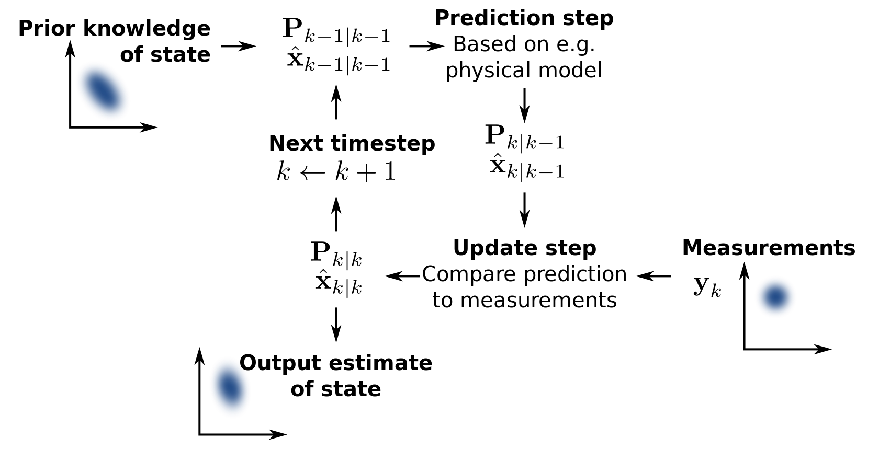

## Definition
**Kalman filtering, also known as linear quadratic estimation (LQE), is an algorithm** that uses a series of measurements observed over time, containing statistical noise and other inaccuracies, and produces estimates of unknown variables that tend to be more precise than those based on a single measurement alone, blah blah (according to [Wikipedia](https://en.wikipedia.org/wiki/Kalman_filter))

Simply put, Kalman Filter is used when

- you have a series of measurements with noise or changing over time
- you want to find true states of something (usually a robot)

## Flowchart of Kalman Filter

1. By linear dynamics, we can predict the object's states(location, velocity, etc). For example,
    - $x = x + velocity \cdot t + \frac{1}{2} \cdot acceleration \cdot t^2$
    - where $x$ is a location $t$ is time, say, in seconds
2. Compute Kalman Gain, which is simply $$\frac{E_{estimate}}{E_{estimate} + E_{measurement}}$$
3. Kalman Gain tells us that if it is close to 1, there is nearly no error in measurement. Hence, we can trust measurement data. If it approaches 0, it means there is a huge error in measurement. So, we should not trust measurement
4. By multiplying Kalman Gain to the difference between measurement and predicted states, we update **the true states** of the object

## Pseudo-Code

There are **1) predict step** and **2) update step**.

#### Predict Step

- $X_k = F_k \cdot X_{k-1} + B_k \cdot u_k$
- $P_k = F_k \cdot P_{k-1} \cdot F_k^T + Q_{k-1}$

where $X_k$ means the (predicted) states of the object at time $k$. $u_k$ means external forces like constant acceleration or gravity or friction etc.

#### Update Step

- $y_k = z_k - H_k \cdot X_k$
- $S_k = H_k \cdot P_k H_k^T + R_k$
- $K_k = P_k \cdot H_k^T S_k^{-1}$
- $X_k = X_k + K_k \cdot y_k$
- $P_k = (I - K_k H_k) P_k$

## Implementation
Although it is incomplete, I am working on creating Kalman filter examples in this [repo](https://github.com/kkweon/kalman-filter-tutorial).

## References
I found the following references are good intro to Kalman Filter and Exmples.

[1] Michel van Biezen, [Special Topics - The Kalman Filter](https://www.youtube.com/watch?v=CaCcOwJPytQ)
[2] Wikipedia, [Kalman Filter](https://en.wikipedia.org/wiki/Kalman_filter)
