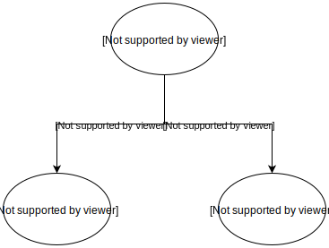

A decision tree is so widely used and its idea is very simple. However, I always tend to forget how it works because it's too simple!
Decision tree uses something called **Information Gain** as its objective. It tries to maximize the **Information Gain**.

## Entropy

Before talking about information gain, we must know **entropy**.

$$ \text{entropy} = - \sum\_{i} p_i \log_2 p_i $$

Its graph would look as below:


Notice that the entropy has its maximum at $p_i = 0.5$

### Example

| Grade | Bumpiness | Speed limit | <span class="text-danger">Speed</span> |
| ----- | --------- | ----------- | -------------------------------------- |
| Steep | Bumpy     | Yes         | <span class="text-danger">Slow</span>  |
| Steep | Smooth    | Yes         | <span class="text-danger">Slow</span>  |
| Flat  | Bumpy     | No          | <span class="text-primary">Fast</span> |
| Steep | Smooth    | No          | <span class="text-primary">Fast</span> |

Suppose we want to predict **speed**. Either _slow_ or _fast_.

The base entropy is 1 because

$$
\begin{aligned}
p_{slow} &= 0.5 \\
p_{fast} &= 0.5 \\
\end{aligned}
$$

$$
\begin{aligned}
\text{entropy} &= - p_{slow} \log_2 p_{slow} - p_{fast} \log_2 p_{fast} \\
               &= - 0.5 \log_2 0.5 - 0.5 \log_2 0.5 \\
               &= - \log_2 0.5 = 1.0
\end{aligned}
$$

## Information Gain

Finally, we can talk about the information gain. Information gain refers to a difference between parent and children entropy.

$$ \text{Information Gain} = \text{base entropy} - \text{weighted average of children entropy} $$

### Example

We have 3 features (_Grade_, _Bumpiness_, _Speed Limit_) and for each feature, we compute its entropy and compute the difference.

In case of _Grade_,

| <span class="text-danger">Grade</span>  | Bumpiness | Speed limit | Speed                                  |
| --------------------------------------- | --------- | ----------- | -------------------------------------- |
| <span class="text-warning">Steep</span> | Bumpy     | Yes         | <span class="text-danger">Slow</span>  |
| <span class="text-warning">Steep</span> | Smooth    | Yes         | <span class="text-danger">Slow</span>  |
| <span class="text-success">Flat </span> | Bumpy     | No          | <span class="text-primary">Fast</span> |
| <span class="text-warning">Steep</span> | Smooth    | No          | <span class="text-primary">Fast</span> |



we have two cases when the grade is _steep_ or _flat_

#### When grade is `steep`

There are 2 slow and 1 fast examples. Therefore,

$$
p_{slow} = \frac{2}{3}
$$

$$
p_{fast} = \frac{1}{3}
$$

$$
\begin{aligned}
\text{entropy} &= - p_{slow} \log_2 p_{slow} - p_{fast} \log_2 p_{fast} \\
               &\approx 0.9184
\end{aligned}
$$

#### When grade is `flat`

It's simple because it's "pure" (there exists only one class). Its entropy is 0.

#### Information Gain

Therefore,

the weighted average of children entropy($e_1$) is

$$ e_1 = \frac{3}{4} \cdot 0.9184 + \frac{1}{4} \cdot 0 $$

the information gain

$$ \text{Information Gain} = 1.0 - e_1 \approx 0.3112 $$

If we repeat for other features (_Bumpiness_, _Speed Limit_)

$$
\text{Information Gain for \textbf{grade}} = 0.311
$$

$$
\text{Information Gain for \textbf{bumpiness}} = 0
$$

$$
\text{Information Gain for \textbf{speed limit}}= 1
$$

Therefore, the next split will occur around **Speed Limit** because it has the greatest information gain.

## Min Split

The decision tree will repeat the above process, but a question is when will stop splitting.
There are two popular hyperparameters for decision trees. One is _depth_ and the other one is _min split_.

_Depth_ refers to the depth of a tree. It will stop if current depth is at the max depth.

_Min split_ refers to the number of minimum samples to split. For example, if a `min split` is 3 and there are 2 samples left.
There will be no split afterward.

## Code Samples

In `sklearn`,

```python
from sklearn import tree
clf = tree.DecisionTreeClassifier()
clf = clf.fit(X, Y)
```
