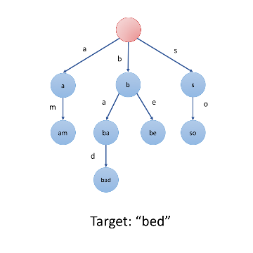
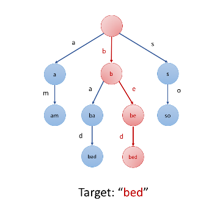

## Trie 는 무엇인가?

[LeetCode](https://leetcode.com/problems/implement-trie-prefix-tree/description/) 에서 풀어볼 수 있다.

전화번호부에 사람이름이 저장되어있다.
만약 LinkedList로 저장되있다면 사람이름을 찾으려면 $O(n)$ 으로 탐색해야 할 것이다.
정렬되있거나, 해시맵을 이용하면 좀더 좋은 성능을 얻을 수 있을 것이다.

하지만, 1회용이 아니라 여러번 반복해서 사용해야 한다면 거기에 "app"만 쳐도 "apple"을 자동완성으로 보여주려면 어떻게 해야 될까?

이때 적합한 자료구조가 `Trie` 이다. 트리(Tree) 구조의 자료 구조의 형태로 char 형을 저장하는 특별한 트리 자료구조이다.

발음은 **트라이** 라고 한다. 트리라고 하면 그냥 트리랑 발음이 구분이 되지 않아서 일부러 트라이라고 한다.


위 그림은 아래 string list를 저장한 Trie 이다.

```
["aba", "abc", "ad", "bad", "bag"]
```

만약 "aba" 라는 사람이 존재하는지 검색하려면 모든 이름을 다 뒤져보지 않더라도 3번만에 바로 찾아 낼 수 있다.
"staff" 라는 사람이 존재하는지 검색하려면 첫글자를 치자마자 존재하지 않는다는걸 알 수 있다.

## 구현 설명

### 구조

일반적으로 트리 구조와 동일하다.

- 글자 1개(char)를 저장하는 노드를 만든다
- 루트 노드는 큰 의미가 없다. 그래서 보통 "\*"와 같은 더미 데이터를 가진 노드가 루트가 된다.

일반적인 Node 구조는 다음과 같다.

```python
class TrieNode(object):
    def __init__(self, char: str, terminal: bool=False):
        self.char = char
        self.children = {}       # type: Dict[char, TrieNode]
        self.terminal = terminal # type: bool 마지막 노드(단어의 마지막 글자)인지 나타낸다.
```

### 삽입

"bed" 라는 단어를 추가한다고 해보자.



#### 자식 노드에 b가 있는지 살펴본다


#### e가 있는지 살펴본다.


#### d가 있는지 살펴본다. 없으면 노드를 생성한다.



즉, $O(\text{\# of character})$ 로 삽입이 가능하다.

```python
def insert(S: str, root: TrieNode) -> None:
    """문자 S를 Trie에 삽입한다."""

    current = root

    for char in S:
        if not char in current.children:
            current.children[char] = TrieNode(char)

        current = current.children[char]
```

### 탐색

탐색도 삽입과 동일하다. 다만

- 노드를 찾지 못할 경우 `False` 등을 반환하면 된다.
- 마지막 노드가 `terminal` 노드인지 확인한다.

```python
def search(S: str, root: TrieNode) -> bool:
    """문자 S가 존재하는지 확인한다"""

    current = root

    for char in S:
        if not char in current.children:
            return False

        current = current.children[char]

    return current.terminal
```

## 전체 코드

최종 완성 코드는 다음과 같다.

```python
class TrieNode(object):
    def __init__(self, char: str, terminal: bool=False):
        self.char = char
        self.children = {}
        self.terminal = terminal

class Trie(object):

    def __init__(self):
        self.root = TrieNode("*")

    def insert(self, word: str):
        """Trie에 단어 `word`를 추가한다."""
        current = self.root

        for ch in word:
            if not ch in current.children:
                current.children[ch] = TrieNode(ch, False)
            current = current.children[ch]

        current.terminal = True

    def search(self, word: str) -> bool:
        """`word`가 존재하는지 확인한다."""

        current = self.root

        for ch in word:
            if not ch in current.children:
                return False
            current = current.children[ch]

        return current.terminal

    def startsWith(self, prefix: str) -> bool:
        """`prefix`로 시작하는 단어가 있는지 확인한다."""
        current = self.root

        for ch in prefix:
            if not ch in current.children:
                return False
            current = current.children[ch]

        return True
```
