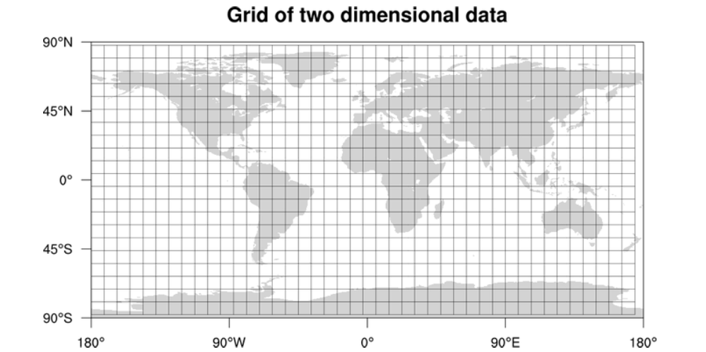
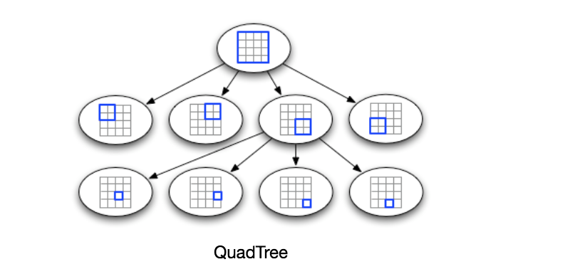
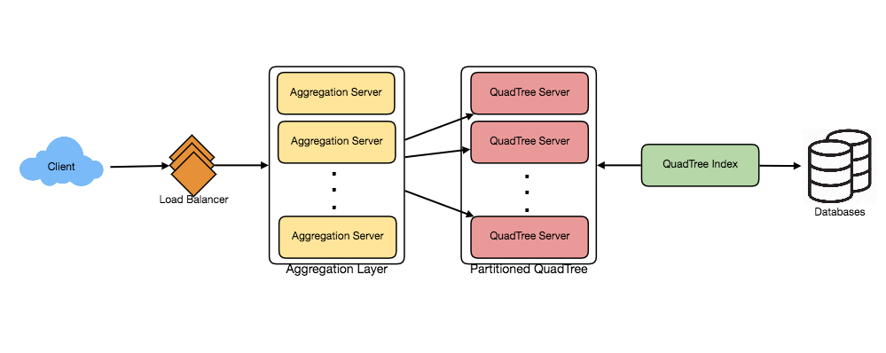
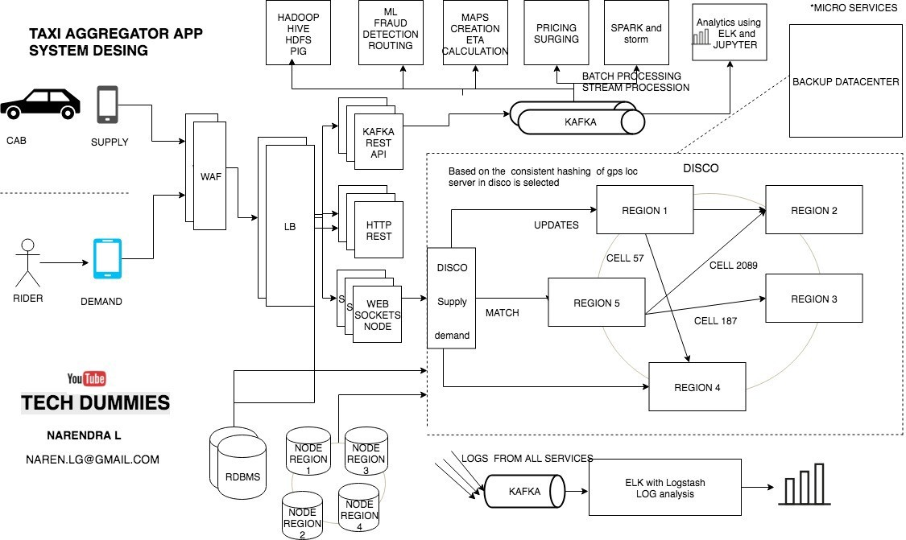

이번에는 (간단한) 우버 (같은) 시스템 디자인을 정리해본다.

## 시스템 디자인

우선 시스템 디자인 방법론에 따라 시작하자

1. 요구 사항을 정리한다.
    - 유저가 ~을 할 수 있는가?
    - ~ 기능이 필요한가?
1. back of the envelope estimation.
    - 대략 유저 수
    - 저장공간 양
    - 트래픽
1. 대략 interface를 정의한다.
    - `User login(username, passwd)` 식으로 대애충 정의 한다
    - 예를 들어 유저가 로그인 하기 위해서 유저명과 비밀번호가 필요하다
1. Data Model 정의
    - SQL vs NoSQL?
    - Entity model: User { userId, name, email, ... }
1. High Level Design
    - 각 콤포넌트를 큰 그림으로 정의한다.
    - 예를 들어 로드 밸런스가 ~에 있고 application server가 있고 database가 있고 하는 식이다.
1. Detailed Design
    - 앞서 정의한 큰 그림에서 더 자세하게 들어간다
    - 데이터를 어떻게 파티션 해야 될까?
    - 모든 유저가 같은 데이터베이스에 접근해야 되는가?
    - 로드 밸런싱은 어떻게 할 것인가 캐시는 어떻게 할 것인가 등등
1. 병목현상이 될만한 곳 확인
    - 마무리로 병목이 될만한 곳을 찾아 본다
    - 노드 하나가 fail 한다면 어떻게 되는가
    - 레플리카는 어떤 노드들이 필요한가

## 우버를 정의하자

우버는 택시와 유사하다.
우버 운전자와 우버 라이더를 매칭해준다.
스마트폰의 우버앱을 통해서 서로 커뮤니케이션을 할 것이다.

## 스펙 (요구사항)

먼저 사용자부터 정의해보자.
두가지 사용자가 있을 것이다.

드라이버와 라이더

- 드라이버는 주기적으로 위치와 상태(e.g., 승객을 태웠는지 안태웠는지 여부)를 서버에 알려주어야 한다
- 라이더는 내 주변에 있는 드라이버들을 볼 수 있어야 한다.
- 라이더는 배차를 요청할 수 있으며 배차를 요쳥하면 주변에 가까운 드라이버들에게 요청이 가게 된다.
- 드라이버가 선택을 하면 드라이버와 라이더는 서로의 위치를 실시간으로 볼 수 있다
- 목적지에 도착하면 드라이버는 목적지에 도착했음을 알리고 trip 을 완료한다.

## 스펙 2 - 제약 사항

제약 사항을 따지기 위해 몇가지 가정을 할 것이다. 물론 여기서는 내마음대로 추정한 값이지만 실제로는 데이터를 통해서 예측해야 되는 부분이다.

- 여기서는 1백만명의 드라이버가 있다고 가정한다.
- 라이더는 100백만명(1억명)의 라이더가 있다고 가정한다.

즉 드라이버와 라이더는 1:100을 가정한다.

그러면 이제 다시 줄여서 daily 드라이버는 얼마나 될까?

- 드라이버는 운행할지 안할지 정보가 없으니 50%, 매일 50만명의 드라이버가 있다고 가정한다
- 라이더는 1% 인 1백만명의 daily 라이더가 있다고 가정한다.
- 그리고 드라이버는 평시에는 3초마다 위치를 보내오고,
- 운전자가 배차 요청을 한후 드라이버가 승낙을 하게 될 경우 서로 위치를 1초마다 공유한다

## 스펙 3 - 드라이버

이정도면 대략적으로 필요한 하드웨어를 계산해보자.

우선 최소한으로 3개만 생각해보자

- 드라이버의 id (1백만명의 드라이버가 있으니 20비트정도면 되지만 안전빵 32비트 = 4바이트가 필요하다)
- 위도 (찾아보니 꽤 정밀한 값이 필요한걸 보니 double 64비트 = 8바이트가 필요하다)
- 경도 (8바이트)

드라이버의 1 개의 위치 정보에는 20 바이트가 필요하다.

전체 드라이버의 수가 1백만명의 위치정보를 메모리에 해시테이블에 담을경우

20 * 1M = 19 MB 메모리 가 필요하다.

필요한 인터넷 회선 속도는 매일 50만(500k)명의 운전자가 최소한 3초다마다 이 값을 보낸다.

20바이트 * 50만명 / 3 sec = 3.18 MB / sec

흔히 초당 3메가의 bandwidth 인터넷 속도가 필요하다.

음 너무 어림짐작이다. 게다가 자료구조에 대해 전혀 생각하지 않았다.

라이더와 가까운 운전자를 찾으려면 어떻게 해야 될까 50만명에 대해서 전부 유클리디안 거리를 계산할 것인가?

우선 지도를 grid로 나타낸다. 그리고 각 지도의 index를 부여한 후 검색하면 어떨까?



우편 번호(zipcode)가 사실 이런 원리이다.

```sql
SELECT *
FROM world
WHERE zipcode = zipcode1
```

만 하고 위도 경도를 비교하면 훨씬 낫기 때문이다.

위 구조를 좀더 발전시켜 나가면 적당한 자료구조로 [쿼드트리](https://en.wikipedia.org/wiki/Quadtree)가 있다.
지역을 4등분하고도 각 4분면에서 또 4등분하고 내려간다



삽입 및 탐색은 일반적인 트리 탐색과 동일하다.
루트노드에서 시작해 알맞은 자식 노드로 계속 타고 내려간다.

이제 라이더도 계산해보자.

## 스펙 4 - 라이더

드라이버의 위치를 사용자들에게 알려주는 방법으로는 무엇이 있을까?
즉 브로드캐스팅 문제이다. 이 경우 실시간으로 위치가 발생하기 때문에 Pull Model 보다는 Push model이 적합한 것을 알 수 있다.

즉, 서버가 PubSub 패턴을 사용해 Subscriber에게 위치를 전송을 한다.
웹소켓으로 담을 경우 필요한 메모리의 양은 얼마나 될지 계산해보자.

우선, 드라이버가 데이터 소스임으로 드라이버의 입장에서 생각을 해보자.
라이더는 모든 드라이버의 위치를 알 필요가 없이 주변 드라이버만 알면 되기 때문에

어림 짐작으로 1명의 드라이버에 10명의 라이더가 subscriber로 존재한다고 가정해보자.
왜? 매일드라이버:매일라이더 = 1:2 지만 실제로 겹치는 구역과 한차에만 붙는게 아니기 때문에 그렇다.

Subscribe하기 위해 필요한 라이더의 정보는

- id (31비트가 필요하지만 안전빵 64비트 = 8바이트)

만 있으면 우선 되기 때문에

500k drivers * 4 byte + 500k drivers * 10 (riders) * 8 byte = 40 MB

의 메모리가 필요하다.

계산이 너무 힘들다.


운전자의 위치가 업데이트 될때마다 10명이 업데이트가 되어야 하는데
50만명의 운전자 위치가 한번 업데이트 되면 5백만개의 broadcast가 발생하는데

5M * 20 byte = 95.36 MB

만약 위 정보를 매 3초마다가 아닌 매 1초 (실시간)으로 보내야 한다면
초당 100메가의 회선이 필요하다.
대충 숫자만 봐도 실제 수의 반의 반도 안될텐데 어마어마한 트래픽이다.

## 파티션

메모리 계산으로는 1대로도 충분할 것 같지만 인덱스의 양도 늘어나게 되면 파티셔닝이 결국에 필요하다.
하지만 만약 지역으로 sharding을 하게 될 경우, 대도시에만 몰리는 현상이 발생하기 때문에 공평하게 랜덤 hash 값으로 sharding을 해야 한다.
대신 query time 때 결국 모든 서버에 query 하는 단점이 존재하지만 앞단에 또 다른 레이어와 캐시등을 활용해 해결하기로 한다.



예를 들어 QuadTree Server의 레플리카를 만들고
마스터 슬레이브 설정을 통해 Read API 는 레플리카에서 읽도록 하고
Write API는 마스터가 담당하도록 한다.

## CAP

분산 시스템을 설정할때는 Consistency, Availability, Partition Tolerance 셋중에 두개를 선택해야 한다.

- Consitency 는 모두가 같은 데이터를 볼 수 있음을 의미한다
- Availability 는 노드가 fail 하더라도 계속 동작해야 함을 의미한다
- Partition Tolerance는 각 노드간 커뮤니케이션이 되지 않더라도 동작함을 의미한다


여기서 선택한 것은 Availability와 Partition Tolerance이다.
즉, 모든 사용자가 모두 같은 자동차를 볼 필요는 없기 때문에 Consistency를 포기할 수 있다.


## API

```
search(location_info, radius, num_result) // 주어진 위치 정보를 가지고 주변 드라이버 검색
match(driver_id, rider_id) // 라이더와 드라이버를 매칭

// 위치 업데이트
update_location_driver(driver_id, new_location)
update_location_rider(rider_id, new_location)
```

## 콤포넌트

계산이 힘들어서 나머진 다음번에 하기로 한다

하지만 [이 글](https://medium.com/@narengowda/ᆼuber-system-design-8b2bc95e2cfe)을 읽어보자


