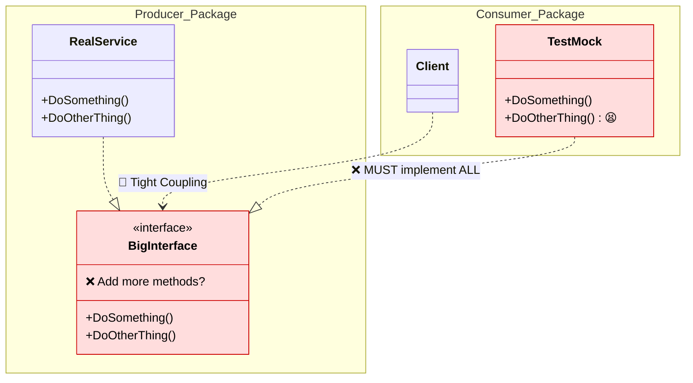
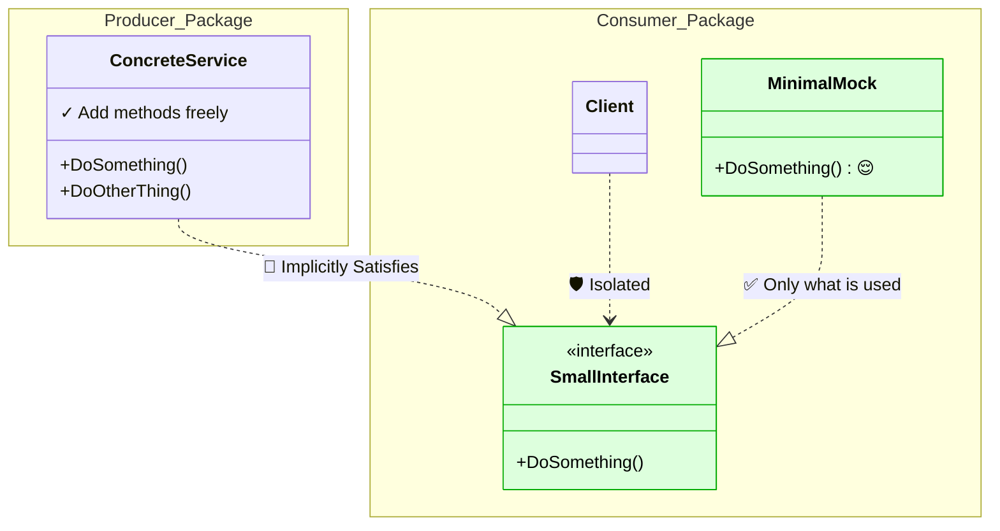

The problem: defining interfaces on the producer side (Java-style) creates tight coupling. Every new method breaks every consumer and every test mock.

The solution: **accept interfaces, return structs.** Producers return concrete types. Consumers define their own small interfaces.

## TLDR

**Bad — Java-style (interface on producer side):**

```go
// producer.go
type SomeService interface {
	DoSomething() string
}

func NewSomeService() SomeService {
	return &someServiceImpl{}
}
```

**Good — Go-style (interface on consumer side):**

```go
// producer.go — returns a concrete struct
type SomeService struct{}

func NewSomeService() *SomeService {
	return &SomeService{}
}

// consumer.go — defines only what it needs
type SomethingDoer interface {
	DoSomething() string
}

func NewAnotherService(doer SomethingDoer) *AnotherService {
	return &AnotherService{doer}
}
```

Adding a new method to `SomeService` now has zero impact on consumers or their tests.

## The Java-Style Mistake

A common pattern for Go developers coming from Java. The producer owns the interface — every consumer depends on it:



**The problem:** Producer owns the interface. When you add `DoOtherThing()` to `SomeService`, ALL implementers break — the real implementation AND every test mock must be updated.

The producer defines an interface and returns it:

```go
type SomeService interface {
	DoSomething() string
}

type someServiceImpl struct {
}

func NewSomeService() SomeService {
	return &someServiceImpl{}
}

func (*someServiceImpl) DoSomething() string {
  return "some-service"
}
```

The consumer depends on that interface. Tests use a mock that implements it:

```go
func NewAnotherService(someService SomeService) AnotherService {
	return &anotherServiceImpl{someService}
}

// anotherservice_test.go
type someMockService struct{}

func (s *someMockService) DoSomething() string {}

func TestAnotherService(t *testing.T) {
	anotherService := &anotherServiceImpl{&someMockService{}}
}
```

## Why This Breaks

Adding a new method to `SomeService` breaks every consumer and every mock:

```diff
 type SomeService interface {
   DoSomething() string
+  DoOtherThing()
 }

 // ...

+ func (*someServiceImpl) DoOtherThing() {
+  fmt.Println("some-service")
+ }
```

Because the interface is defined on the producer side, every file that depends on it — including test mocks — must be updated. The more consumers you have, the worse this gets.

## The Fix

Each consumer owns its own interface — the producer knows nothing about them:



**The fix:** Each consumer owns its own interface and only declares what it needs. Adding `DoOtherThing()` to `SomeService` doesn't affect `Consumer` (which only uses `DoSomething()`). Each consumer is completely isolated.

Two rules:

- **Producers return concrete types.** No interface on the producer side.
- **Consumers define their own interfaces.** Each consumer declares only the methods it needs.

The producer returns a struct:

```go
// producer.go
type SomeService struct{}

func NewSomeService() *SomeService {
	return &SomeService{}
}

func (s *SomeService) DoSomething() string {
	return "some-service"
}
```

The consumer defines a small interface with only the methods it needs:

```go
// consumer.go
type SomethingDoer interface {
	DoSomething() string
}

func NewAnotherService(doer SomethingDoer) *AnotherService {
	return &AnotherService{doer}
}
```

Adding a method to the producer has zero impact on the consumer:

```diff
  // producer.go
  type SomeService struct{}

- func NewSomeService() SomeService {
+ func NewSomeService() *SomeService {
    return &SomeService{}
  }

- func (s SomeService) DoSomething() string {
+ func (s *SomeService) DoSomething() string {
    return "some-service"
  }

+ // this change won't affect consumer.go
+ func (s *SomeService) DoAnotherThing() {
+   fmt.Println("some-service")
+ }
```

## Why This Matters

- **Loose coupling.** Producers evolve independently. New methods never break existing consumers.
- **Easier testing.** Mocks implement only the methods the test cares about, not an entire interface.
- **Smaller interfaces.** Go's standard library follows this pattern — `io.Reader` is one method, `io.Writer` is one method. As Rob Pike says: *"The bigger the interface, the weaker the abstraction."*

This is also the official recommendation from the [Go Code Review Comments](https://go.dev/wiki/CodeReviewComments#interfaces):

> Go interfaces generally belong in the package that uses values of the interface type, not the package that implements those values.
